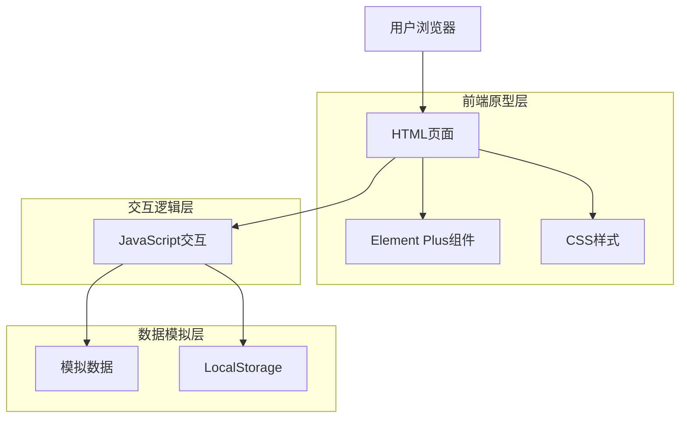
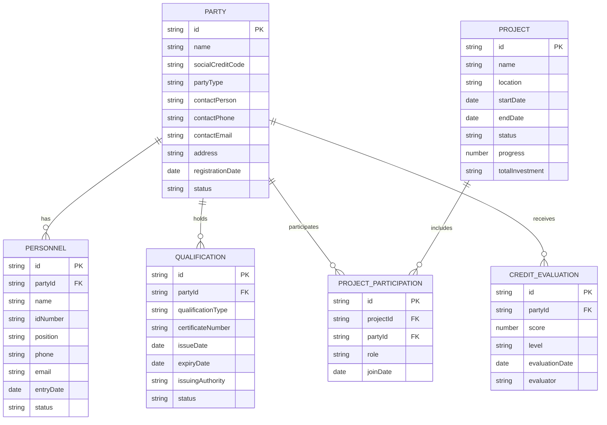
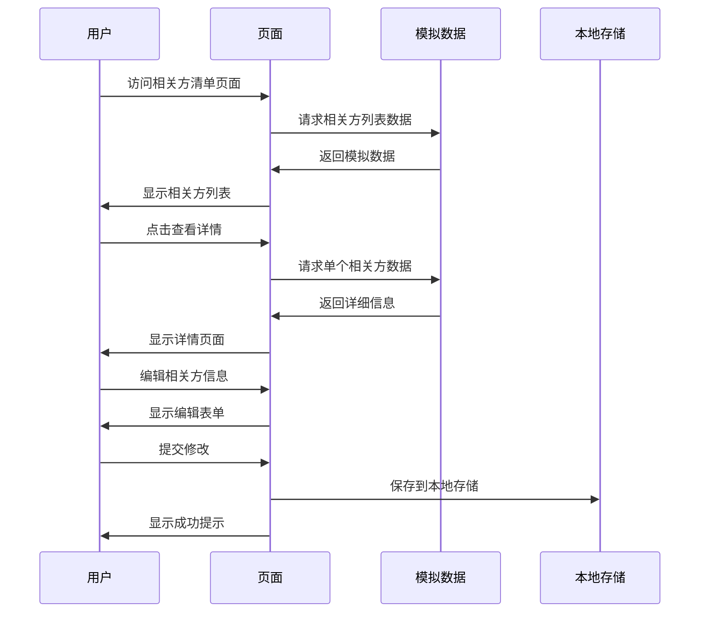
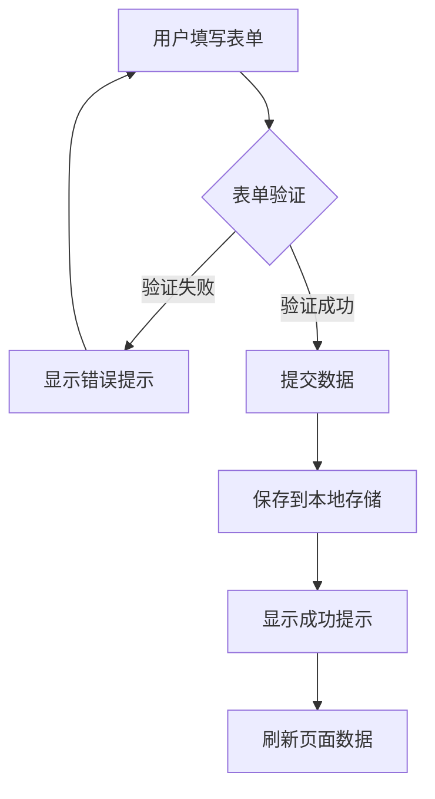

## 1.架构设计



## 2.技术描述

- 前端：HTML5 + CSS3 + JavaScript ES6+ + Element Plus（CDN）
- 图表：ECharts 5.x
- 图标：Font Awesome 6.x
- 数据：JavaScript对象 + LocalStorage

## 3.路由定义

| 路由 | 用途 |
|------|------|
| /安全管理系统.html | 主页面，显示系统概览和导航菜单 |
| /相关方管理/相关方清单.html | 相关方列表页面，展示所有相关方信息 |
| /相关方管理/相关方详情.html | 相关方详细信息页面，显示单个相关方完整信息 |
| /相关方管理/账户开通.html | 相关方注册审核页面，处理新相关方申请 |
| /相关方管理/人员管理.html | 人员档案管理页面，管理相关方人员信息 |
| /相关方管理/资质管理.html | 资质证书管理页面，管理和监控资质状态 |
| /项目管理/项目概览.html | 项目信息总览页面，显示所有项目状态 |
| /项目管理/项目详情.html | 单个项目详细信息页面 |
| /信用评价/评价管理.html | 信用评价管理页面，展示评价列表和结果 |
| /信用评价/信用档案.html | 承包商信用档案页面，显示历史评价记录 |
| /租赁场所/场所管理.html | 租赁场所管理页面，管理场所信息和状态 |

## 4.前端组件架构

### 4.1 页面结构组件

**通用页面框架**
```html
<!DOCTYPE html>
<html lang="zh-CN">
<head>
    <meta charset="UTF-8">
    <meta name="viewport" content="width=device-width, initial-scale=1.0">
    <title>安全管理系统</title>
    <!-- Element Plus CSS -->
    <link rel="stylesheet" href="https://unpkg.com/element-plus/dist/index.css">
    <!-- Font Awesome -->
    <link rel="stylesheet" href="https://cdnjs.cloudflare.com/ajax/libs/font-awesome/6.0.0/css/all.min.css">
    <!-- 自定义样式 -->
    <link rel="stylesheet" href="../共享资源/css/common.css">
</head>
<body>
    <div id="app">
        <!-- 顶部导航栏 -->
        <header class="header">
            <!-- 导航内容 -->
        </header>
        
        <!-- 侧边栏 -->
        <aside class="sidebar">
            <!-- 菜单内容 -->
        </aside>
        
        <!-- 主内容区 -->
        <main class="main-content">
            <!-- 页面具体内容 -->
        </main>
    </div>
    
    <!-- Element Plus JS -->
    <script src="https://unpkg.com/vue@3/dist/vue.global.js"></script>
    <script src="https://unpkg.com/element-plus/dist/index.full.js"></script>
    <!-- ECharts -->
    <script src="https://cdn.jsdelivr.net/npm/echarts@5.4.0/dist/echarts.min.js"></script>
    <!-- 模拟数据 -->
    <script src="../共享资源/js/mock-data.js"></script>
    <!-- 通用脚本 -->
    <script src="../共享资源/js/common.js"></script>
    <!-- 页面脚本 -->
    <script src="./page-script.js"></script>
</body>
</html>
```

### 4.2 核心JavaScript模块

**通用工具函数 (common.js)**
```javascript
// 页面导航函数
function navigateTo(url) {
    window.location.href = url;
}

// 消息提示
function showMessage(message, type = 'success') {
    ElMessage({
        message: message,
        type: type,
        duration: 3000
    });
}

// 确认对话框
function showConfirm(message, callback) {
    ElMessageBox.confirm(message, '确认操作', {
        confirmButtonText: '确定',
        cancelButtonText: '取消',
        type: 'warning'
    }).then(callback).catch(() => {});
}

// 格式化日期
function formatDate(date) {
    return new Date(date).toLocaleDateString('zh-CN');
}

// 数据存储
function saveToStorage(key, data) {
    localStorage.setItem(key, JSON.stringify(data));
}

function getFromStorage(key) {
    const data = localStorage.getItem(key);
    return data ? JSON.parse(data) : null;
}
```

**模拟数据管理 (mock-data.js)**
```javascript
// 相关方模拟数据
const mockParties = [
    {
        id: '1',
        name: '中建三局集团有限公司',
        socialCreditCode: '91420100177781234X',
        partyType: '总承包商',
        contactPerson: '张经理',
        contactPhone: '138-0000-0000',
        contactEmail: 'zhang@cscec.com',
        address: '湖北省武汉市洪山区',
        registrationDate: '2024-01-15',
        status: 'active',
        qualificationLevel: 'A级',
        projectCount: 15,
        creditScore: 95
    },
    {
        id: '2',
        name: '中铁建工集团有限公司',
        socialCreditCode: '91110000100000456Y',
        partyType: '分包商',
        contactPerson: '李总监',
        contactPhone: '139-1111-1111',
        contactEmail: 'li@crccg.com',
        address: '北京市朝阳区',
        registrationDate: '2024-02-20',
        status: 'active',
        qualificationLevel: 'B级',
        projectCount: 8,
        creditScore: 88
    }
];

// 人员模拟数据
const mockPersonnel = [
    {
        id: '1',
        partyId: '1',
        name: '李工程师',
        idNumber: '420100199001011234',
        position: '项目经理',
        phone: '139-0000-0000',
        email: 'li@cscec.com',
        entryDate: '2024-02-01',
        status: 'active',
        certifications: ['一级建造师', '安全工程师']
    }
];

// 项目模拟数据
const mockProjects = [
    {
        id: '1',
        name: 'XX集团二期项目',
        location: '湖北省武汉市',
        startDate: '2024-01-01',
        endDate: '2025-12-31',
        status: '进行中',
        progress: 35,
        totalInvestment: '50亿元',
        safetyLevel: '优秀',
        participatingParties: ['1', '2']
    }
];

// 数据访问接口
const MockAPI = {
    // 获取相关方列表
    getParties: () => Promise.resolve(mockParties),
    
    // 获取单个相关方
    getParty: (id) => Promise.resolve(mockParties.find(p => p.id === id)),
    
    // 获取人员列表
    getPersonnel: (partyId) => Promise.resolve(
        mockPersonnel.filter(p => !partyId || p.partyId === partyId)
    ),
    
    // 获取项目列表
    getProjects: () => Promise.resolve(mockProjects),
    
    // 模拟延迟
    delay: (ms = 500) => new Promise(resolve => setTimeout(resolve, ms))
};
```

## 5.数据模型

### 5.1 数据模型定义



### 5.2 前端数据结构

**相关方数据结构**
```javascript
const PartySchema = {
    id: 'string',                    // 唯一标识
    name: 'string',                  // 企业名称
    socialCreditCode: 'string',      // 统一社会信用代码
    partyType: 'string',             // 相关方类型：总承包商/分包商/供应商
    contactPerson: 'string',         // 联系人
    contactPhone: 'string',          // 联系电话
    contactEmail: 'string',          // 联系邮箱
    address: 'string',               // 企业地址
    registrationDate: 'string',      // 注册日期
    status: 'string',                // 状态：active/inactive/pending
    qualificationLevel: 'string',    // 资质等级
    projectCount: 'number',          // 参与项目数量
    creditScore: 'number'            // 信用评分
};
```

**项目数据结构**
```javascript
const ProjectSchema = {
    id: 'string',                    // 项目ID
    name: 'string',                  // 项目名称
    location: 'string',              // 项目地点
    startDate: 'string',             // 开始日期
    endDate: 'string',               // 结束日期
    status: 'string',                // 项目状态
    progress: 'number',              // 进度百分比
    totalInvestment: 'string',       // 总投资
    safetyLevel: 'string',           // 安全等级
    participatingParties: 'array'    // 参与相关方ID列表
};
```

## 6.页面交互流程

### 6.1 相关方管理流程



### 6.2 表单验证流程

