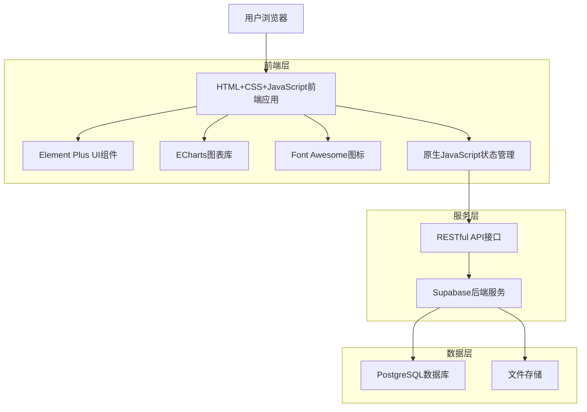
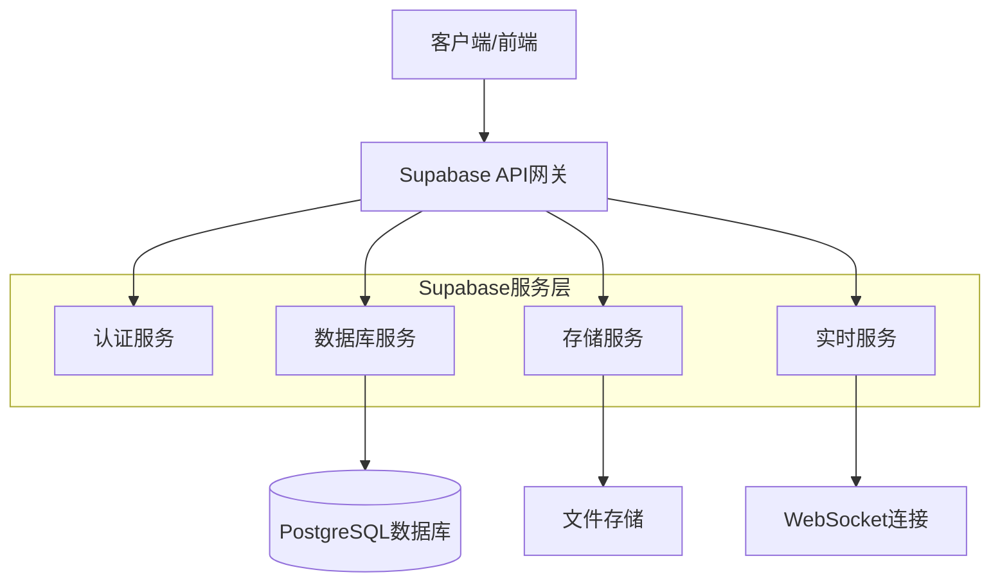
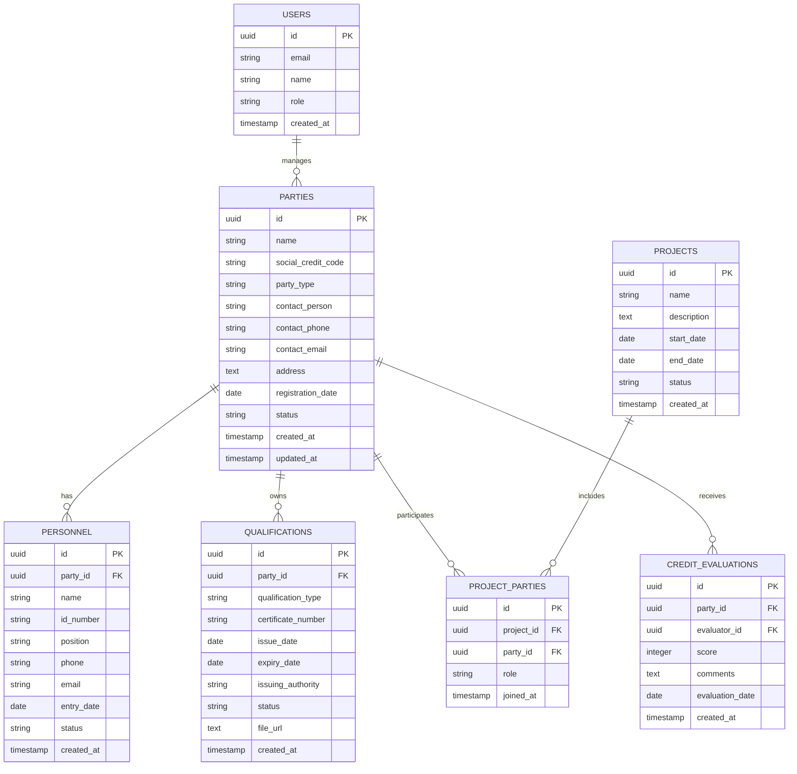

# 安全管理系统融合技术架构文档

## 1. 架构设计



## 2. 技术描述

**前端技术栈：**
- HTML5 + CSS3 + JavaScript ES6+
- Element Plus@2.4.0 (UI组件库)
- ECharts@5.4.0 (图表库)
- Font Awesome@6.0.0 (图标库)
- 原生JavaScript (状态管理)

**后端服务：**
- Supabase (BaaS平台)
- PostgreSQL (数据库)
- Supabase Storage (文件存储)
- Supabase Auth (身份认证)

## 3. 路由定义

| 路由 | 用途 |
|------|------|
| /index.html | 系统首页，显示仪表板和统计数据 |
| /login.html | 登录页面，用户身份验证 |
| /parties/list.html | 相关方清单页面，显示所有相关方信息 |
| /parties/register.html | 相关方注册页面，新增相关方信息 |
| /parties/detail.html | 相关方详情页面，查看和编辑相关方信息 |
| /personnel/manage.html | 人员管理页面，管理相关方人员信息 |
| /qualifications/manage.html | 资质管理页面，管理证书和资质信息 |
| /projects/list.html | 项目管理页面，显示项目列表和详情 |
| /safety/meetings.html | 安全会议管理页面 |
| /safety/risk-analysis.html | 风险分析看板页面 |
| /safety/inspections.html | 安全检查和无票作业管理 |
| /credit/evaluation.html | 信用评价管理页面 |
| /venues/manage.html | 租赁场所管理页面 |
| /system/users.html | 用户管理页面，系统管理员使用 |
| /system/settings.html | 系统设置页面，配置系统参数 |

## 4. API定义

### 4.1 核心API

**用户认证相关**
```
POST /auth/v1/token
```

请求参数：
| 参数名 | 参数类型 | 是否必需 | 描述 |
|--------|----------|----------|------|
| email | string | true | 用户邮箱 |
| password | string | true | 用户密码 |

响应参数：
| 参数名 | 参数类型 | 描述 |
|--------|----------|------|
| access_token | string | 访问令牌 |
| refresh_token | string | 刷新令牌 |
| user | object | 用户信息 |

**相关方管理相关**
```
GET /rest/v1/parties
POST /rest/v1/parties
PUT /rest/v1/parties/{id}
DELETE /rest/v1/parties/{id}
```

请求参数（POST/PUT）：
| 参数名 | 参数类型 | 是否必需 | 描述 |
|--------|----------|----------|------|
| name | string | true | 相关方名称 |
| social_credit_code | string | false | 统一社会信用代码 |
| party_type | string | true | 相关方类型 |
| contact_person | string | false | 联系人 |
| contact_phone | string | false | 联系电话 |
| contact_email | string | false | 联系邮箱 |
| address | string | false | 地址 |

**人员管理相关**
```
GET /rest/v1/personnel
POST /rest/v1/personnel
PUT /rest/v1/personnel/{id}
DELETE /rest/v1/personnel/{id}
```

**资质管理相关**
```
GET /rest/v1/qualifications
POST /rest/v1/qualifications
PUT /rest/v1/qualifications/{id}
DELETE /rest/v1/qualifications/{id}
```

**文件上传**
```
POST /storage/v1/object/{bucket_name}
```

## 5. 服务器架构图



## 6. 数据模型

### 6.1 数据模型定义



### 6.2 数据定义语言

**相关方表 (parties)**
```sql
-- 创建表
CREATE TABLE parties (
    id UUID PRIMARY KEY DEFAULT gen_random_uuid(),
    name VARCHAR(255) NOT NULL,
    social_credit_code VARCHAR(50) UNIQUE,
    party_type VARCHAR(50) NOT NULL CHECK (party_type IN ('contractor', 'subcontractor', 'supplier', 'consultant')),
    contact_person VARCHAR(100),
    contact_phone VARCHAR(20),
    contact_email VARCHAR(255),
    address TEXT,
    registration_date DATE DEFAULT CURRENT_DATE,
    status VARCHAR(20) DEFAULT 'active' CHECK (status IN ('active', 'inactive', 'suspended')),
    created_at TIMESTAMP WITH TIME ZONE DEFAULT NOW(),
    updated_at TIMESTAMP WITH TIME ZONE DEFAULT NOW()
);

-- 创建索引
CREATE INDEX idx_parties_type ON parties(party_type);
CREATE INDEX idx_parties_status ON parties(status);
CREATE INDEX idx_parties_created_at ON parties(created_at DESC);

-- 权限设置
GRANT SELECT ON parties TO anon;
GRANT ALL PRIVILEGES ON parties TO authenticated;
```

**人员表 (personnel)**
```sql
-- 创建表
CREATE TABLE personnel (
    id UUID PRIMARY KEY DEFAULT gen_random_uuid(),
    party_id UUID REFERENCES parties(id) ON DELETE CASCADE,
    name VARCHAR(100) NOT NULL,
    id_number VARCHAR(50),
    position VARCHAR(100),
    phone VARCHAR(20),
    email VARCHAR(255),
    entry_date DATE,
    status VARCHAR(20) DEFAULT 'active' CHECK (status IN ('active', 'inactive', 'transferred')),
    created_at TIMESTAMP WITH TIME ZONE DEFAULT NOW(),
    updated_at TIMESTAMP WITH TIME ZONE DEFAULT NOW()
);

-- 创建索引
CREATE INDEX idx_personnel_party_id ON personnel(party_id);
CREATE INDEX idx_personnel_status ON personnel(status);

-- 权限设置
GRANT SELECT ON personnel TO anon;
GRANT ALL PRIVILEGES ON personnel TO authenticated;
```

**资质表 (qualifications)**
```sql
-- 创建表
CREATE TABLE qualifications (
    id UUID PRIMARY KEY DEFAULT gen_random_uuid(),
    party_id UUID REFERENCES parties(id) ON DELETE CASCADE,
    qualification_type VARCHAR(100) NOT NULL,
    certificate_number VARCHAR(100),
    issue_date DATE,
    expiry_date DATE,
    issuing_authority VARCHAR(255),
    status VARCHAR(20) DEFAULT 'valid' CHECK (status IN ('valid', 'expired', 'revoked', 'pending')),
    file_url TEXT,
    created_at TIMESTAMP WITH TIME ZONE DEFAULT NOW(),
    updated_at TIMESTAMP WITH TIME ZONE DEFAULT NOW()
);

-- 创建索引
CREATE INDEX idx_qualifications_party_id ON qualifications(party_id);
CREATE INDEX idx_qualifications_expiry_date ON qualifications(expiry_date);
CREATE INDEX idx_qualifications_status ON qualifications(status);

-- 权限设置
GRANT SELECT ON qualifications TO anon;
GRANT ALL PRIVILEGES ON qualifications TO authenticated;
```

**项目表 (projects)**
```sql
-- 创建表
CREATE TABLE projects (
    id UUID PRIMARY KEY DEFAULT gen_random_uuid(),
    name VARCHAR(255) NOT NULL,
    description TEXT,
    start_date DATE,
    end_date DATE,
    status VARCHAR(20) DEFAULT 'planning' CHECK (status IN ('planning', 'active', 'completed', 'suspended')),
    created_at TIMESTAMP WITH TIME ZONE DEFAULT NOW(),
    updated_at TIMESTAMP WITH TIME ZONE DEFAULT NOW()
);

-- 权限设置
GRANT SELECT ON projects TO anon;
GRANT ALL PRIVILEGES ON projects TO authenticated;
```

**项目相关方关联表 (project_parties)**
```sql
-- 创建表
CREATE TABLE project_parties (
    id UUID PRIMARY KEY DEFAULT gen_random_uuid(),
    project_id UUID REFERENCES projects(id) ON DELETE CASCADE,
    party_id UUID REFERENCES parties(id) ON DELETE CASCADE,
    role VARCHAR(50) NOT NULL,
    joined_at TIMESTAMP WITH TIME ZONE DEFAULT NOW(),
    UNIQUE(project_id, party_id)
);

-- 创建索引
CREATE INDEX idx_project_parties_project_id ON project_parties(project_id);
CREATE INDEX idx_project_parties_party_id ON project_parties(party_id);

-- 权限设置
GRANT SELECT ON project_parties TO anon;
GRANT ALL PRIVILEGES ON project_parties TO authenticated;
```

**信用评价表 (credit_evaluations)**
```sql
-- 创建表
CREATE TABLE credit_evaluations (
    id UUID PRIMARY KEY DEFAULT gen_random_uuid(),
    party_id UUID REFERENCES parties(id) ON DELETE CASCADE,
    evaluator_id UUID REFERENCES auth.users(id),
    score INTEGER CHECK (score >= 0 AND score <= 100),
    comments TEXT,
    evaluation_date DATE DEFAULT CURRENT_DATE,
    created_at TIMESTAMP WITH TIME ZONE DEFAULT NOW()
);

-- 创建索引
CREATE INDEX idx_credit_evaluations_party_id ON credit_evaluations(party_id);
CREATE INDEX idx_credit_evaluations_score ON credit_evaluations(score DESC);
CREATE INDEX idx_credit_evaluations_date ON credit_evaluations(evaluation_date DESC);

-- 权限设置
GRANT SELECT ON credit_evaluations TO anon;
GRANT ALL PRIVILEGES ON credit_evaluations TO authenticated;
```

**初始化数据**
```sql
-- 插入示例相关方数据
INSERT INTO parties (name, social_credit_code, party_type, contact_person, contact_phone, contact_email) VALUES
('中建三局集团有限公司', '91420100177779797X', 'contractor', '张经理', '027-12345678', 'zhang@cscec.com'),
('武汉建工集团股份有限公司', '91420100177779798Y', 'subcontractor', '李经理', '027-87654321', 'li@whjg.com'),
('湖北省建筑材料工业设计研究院', '91420100177779799Z', 'supplier', '王经理', '027-11111111', 'wang@hbjc.com');

-- 插入示例项目数据
INSERT INTO projects (name, description, start_date, end_date, status) VALUES
('XX集团二期项目', '大型工业园区建设项目', '2