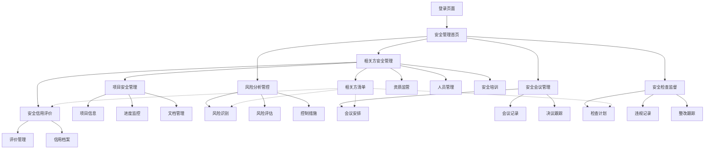

# 安全管理系统前端原型融合方案

## 1. 产品概述

基于现有安全管理系统的HTML+CSS+JavaScript+Element Plus技术栈，将Coze相关方原型系统的UI界面和交互功能以静态页面形式整合到现有前端原型中，实现统一的前端演示效果。

本方案专注于前端原型开发，通过HTML页面模拟相关方管理、项目管理、信用评价等功能界面，提供完整的用户体验演示，为后续系统开发提供可视化参考。

## 2. 核心功能

### 2.1 用户角色

| 角色     | 注册方式   | 核心权限                   |
| ------ | ------ | ---------------------- |
| 系统管理员  | 内部分配账号 | 全系统管理权限，用户管理，系统配置      |
| 安全管理员  | 管理员创建  | 安全监督，相关方管理，风险控制，会议管理   |
| 项目管理员  | 管理员创建  | 项目范围内的安全监督，数据查看        |
| 相关方负责人 | 邀请注册   | 本单位信息维护，人员管理，资质上传，安全培训 |
| 安全监督员  | 内部分配   | 安全检查，风险评估，相关方监督        |

### 2.2 功能模块

整合后的安全管理系统包含以下主要模块：

1. **安全管理首页**：安全概览、统计数据、预警信息、快速入口
2. **安全管理核心模块**：

   * **相关方安全管理**：相关方清单、资质监管、人员管理、安全培训
     - 项目安全管理：项目安全信息、进度监控、文档管理
     - 安全信用评价：相关方安全信用评价、档案管理、评价报告

   * **风险分析管控**：风险识别、评估、控制措施、跟踪监督

   * **安全会议管理**：会议安排、记录、决议跟踪、相关方参与

   * **安全检查监督**：无票作业检查、违规记录、整改跟踪
3. **系统管理**：用户管理、权限配置、系统设置

### 2.3 页面详情

| 页面名称    | 模块名称  | 功能描述                         |
| ------- | ----- | ---------------------------- |
| 安全管理首页  | 安全概览  | 显示安全指标、相关方状态、风险预警、待办事项等关键数据  |
| 安全管理首页  | 快速入口  | 提供安全检查、相关方管理、会议安排等快速访问入口     |
| 相关方安全管理 | 相关方清单 | 展示所有相关方安全信息，资质状态，安全评级，支持筛选搜索 |
| 相关方安全管理 | 资质监管  | 监控相关方安全资质证书有效期，预警提醒，审核管理     |
| 相关方安全管理 | 人员管理  | 管理相关方安全管理人员信息、证书、培训记录        |
| 相关方安全管理 | 安全培训  | 相关方安全培训计划、记录、考核结果管理          |
| 风险分析管控  | 风险识别  | 识别项目安全风险，关联相关方责任，建立风险档案      |
| 风险分析管控  | 风险评估  | 评估风险等级，制定控制措施，分配相关方责任        |
| 安全会议管理  | 会议安排  | 创建安全会议，邀请相关方参与，会议提醒          |
| 安全会议管理  | 会议记录  | 记录会议内容，决议事项，相关方责任分工          |
| 安全检查监督  | 检查计划  | 制定安全检查计划，分配检查任务，涉及相关方范围      |
| 安全检查监督  | 违规记录  | 记录相关方违规行为，整改要求，跟踪处理结果        |
| 相关方安全管理 | 项目安全管理 | 相关方项目安全信息、进度监控、文档管理          |
| 相关方安全管理 | 安全信用评价 | 相关方安全信用评价、评分规则、历史记录、信用档案     |

## 3. 核心流程

### 主要安全管理操作流程：

**安全管理员流程：**
登录系统 → 查看安全概览 → 监督相关方安全状态 → 审核安全资质 → 安排安全会议 → 处理安全检查 → 评价相关方安全信用

**项目管理员流程：**
登录系统 → 查看项目安全状况 → 监控相关方安全表现 → 参与安全会议 → 查看风险分析 → 跟踪整改措施

**相关方负责人流程：**
登录系统 → 维护安全管理信息 → 管理安全人员档案 → 上传安全资质证书 → 参与安全会议 → 接受安全培训 → 查看安全评价

**安全监督员流程：**
登录系统 → 执行安全检查 → 记录相关方违规行为 → 跟踪整改进度 → 评估风险控制效果 → 上报安全状况



## 4. 用户界面设计

### 4.1 设计风格

* **主色调**：#409EFF（Element Plus蓝色）、#67C23A（成功绿色）

* **辅助色**：#E6A23C（警告橙色）、#F56C6C（危险红色）、#909399（信息灰色）

* **按钮样式**：圆角按钮，支持不同尺寸和状态

* **字体**：系统默认字体，标题14-16px，正文12-14px

* **布局风格**：卡片式布局，左侧导航，顶部面包屑导航

* **图标风格**：使用Font Awesome图标库，保持一致性

### 4.2 页面设计概览

| 页面名称  | 模块名称 | UI元素                        |
| ----- | ---- | --------------------------- |
| 首页仪表板 | 统计卡片 | 白色卡片背景，彩色图标，大号数字显示，渐变背景     |
| 首页仪表板 | 图表展示 | 使用ECharts图表库，蓝色主题，响应式设计     |
| 相关方清单 | 数据表格 | Element Plus表格组件，斑马纹，可排序，分页 |
| 相关方清单 | 筛选器  | 下拉选择器，日期选择器，搜索框组合           |
| 表单页面  | 表单组件 | Element Plus表单组件，标签对齐，验证提示  |
| 弹窗组件  | 对话框  | 居中显示，圆角边框，阴影效果，响应式宽度        |

### 4.3 响应式设计

系统采用桌面优先的响应式设计，支持平板和移动端适配：

* 桌面端（>1200px）：完整功能展示

* 平板端（768-1200px）：侧边栏可折叠，表格横向滚动

* 移动端（<768px）：侧边栏抽屉式，卡片式布局优化

## 5. 技术实施方案

### 5.1 前端原型技术栈

**核心技术：**

* HTML5 + CSS3 + JavaScript ES6+

* Element Plus UI组件库（CDN引入）

* Font Awesome图标库

* ECharts图表库（用于数据可视化演示）

* 原生JavaScript实现页面交互和模拟数据

**数据模拟：**

* 使用JavaScript对象模拟后端数据

* LocalStorage存储临时数据状态

* 模拟API调用和响应效果

### 5.2 前端页面开发策略

**第一阶段：页面结构搭建**

1. 复制现有安全管理系统的页面框架结构
2. 创建相关方管理相关的HTML页面文件
3. 统一页面头部、侧边栏和底部结构

**第二阶段：功能界面实现**

1. 使用Element Plus组件构建相关方列表、表单页面
2. 实现项目管理和信用评价的静态展示页面
3. 添加模拟数据和基础交互效果

**第三阶段：交互完善**

1. 实现页面间的导航跳转
2. 添加表单验证和提交反馈效果
3. 完善响应式布局和动画效果

### 5.3 模拟数据结构

**相关方数据模型**

```javascript
const mockParties = [
    {
        id: '1',
        name: '中建三局集团有限公司',
        socialCreditCode: '91420100177781234X',
        partyType: '总承包商',
        contactPerson: '张经理',
        contactPhone: '138-0000-0000',
        contactEmail: 'zhang@cscec.com',
        address: '湖北省武汉市洪山区',
        registrationDate: '2024-01-15',
        status: 'active'
    }
    // ... 更多模拟数据
];
```

**人员数据模型**

```javascript
const mockPersonnel = [
    {
        id: '1',
        partyId: '1',
        name: '李工程师',
        idNumber: '420100199001011234',
        position: '项目经理',
        phone: '139-0000-0000',
        email: 'li@cscec.com',
        entryDate: '2024-02-01',
        status: 'active'
    }
    // ... 更多模拟数据
];
```

**资质数据模型**

```javascript
const mockQualifications = [
    {
        id: '1',
        partyId: '1',
        qualificationType: '建筑工程施工总承包一级',
        certificateNumber: 'D142001234',
        issueDate: '2023-01-01',
        expiryDate: '2028-01-01',
        issuingAuthority: '住房和城乡建设部',
        status: 'valid'
    }
    // ... 更多模拟数据
];
```

### 5.4 前端原型实施步骤

**准备阶段（1天）**

1. 分析现有HTML页面结构和样式规范
2. 整理Coze原型的功能界面需求
3. 准备开发工具和素材资源

**开发阶段（3-5天）**

1. 第1天：创建相关方管理页面框架
2. 第2天：实现相关方列表和详情页面
3. 第3天：开发项目管理和信用评价页面
4. 第4天：完善表单交互和数据展示
5. 第5天：统一样式和优化用户体验

**测试阶段（1天）**

1. 页面功能和交互测试
2. 不同浏览器兼容性测试
3. 响应式布局测试

**交付阶段（半天）**

1. 整理页面文件和资源
2. 编写使用说明文档
3. 演示原型功能

### 5.5 开发注意事项

**技术要点：**

* 保持与现有页面的样式一致性

* 确保所有交互效果的流畅性

* 模拟数据的真实性和完整性

**质量保证：**

* 代码结构清晰，注释完整

* 页面加载速度优化

* 跨浏览器兼容性测试

## 6. 预期成果

**原型展示：**

* 完整的相关方管理功能界面演示

* 统一的视觉风格和交互体验

* 可操作的前端功能模拟

**开发价值：**

* 为后续系统开发提供清晰的界面参考

* 验证功能设计的可行性和用户体验

* 降低开发沟通成本和理解偏差

**项目收益：**

* 快速展示系统功能和界面效果

* 便于收集用户反馈和需求调整

* 为技术选型和架构设计提供依据

## 7. 页面文件结构

```
安全管理系统/
├── 安全管理/
│   ├── 相关方安全管理/
│   │   ├── 相关方清单.html      # 相关方安全信息列表
│   │   ├── 相关方详情.html      # 相关方安全详细信息
│   │   ├── 资质监管.html        # 安全资质监管页面
│   │   ├── 人员管理.html        # 安全管理人员档案
│   │   └── 安全培训.html        # 相关方安全培训管理
│   ├── 风险分析管控/
│   │   ├── 风险识别.html        # 安全风险识别页面
│   │   ├── 风险评估.html        # 风险评估和控制措施
│   │   └── 风险档案.html        # 风险管控档案
│   ├── 安全会议管理/
│   │   ├── 会议安排.html        # 安全会议安排
│   │   ├── 会议记录.html        # 会议记录和决议
│   │   └── 决议跟踪.html        # 会议决议跟踪
│   ├── 安全检查监督/
│   │   ├── 检查计划.html        # 安全检查计划
│   │   ├── 违规记录.html        # 相关方违规记录
│   │   └── 整改跟踪.html        # 整改措施跟踪
│   └── 安全信用评价/
│       ├── 评价管理.html        # 相关方安全信用评价
│       ├── 信用档案.html        # 安全信用档案
│       └── 评价报告.html        # 安全信用评价报告

├── 共享资源/
│   ├── css/
│   │   ├── safety-common.css    # 安全管理通用样式
│   │   ├── party-components.css # 相关方组件样式
│   │   └── risk-components.css  # 风险管控组件样式
│   ├── js/
│   │   ├── safety-common.js     # 安全管理通用脚本
│   │   ├── party-data.js        # 相关方模拟数据
│   │   ├── risk-data.js         # 风险管控模拟数据
│   │   └── safety-utils.js      # 安全管理工具函数
│   └── images/
│       ├── safety-icons/        # 安全管理图标
│       └── party-avatars/       # 相关方头像
└── 安全管理系统.html            # 主入口页面（安全管理导航）
```

