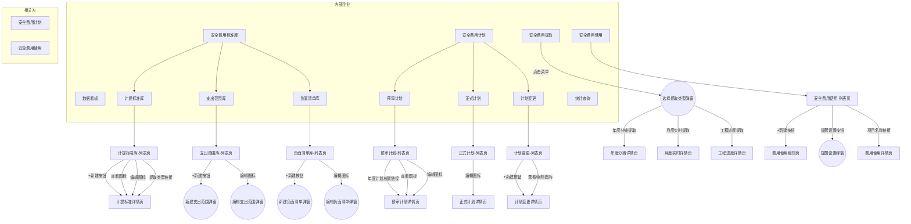

# 安全生产费用管理系统 - 菜单链路图

## 一、菜单-页面-弹窗链路总览

### 1.1 菜单结构图

**图例说明**：
- 方形 `[]` = 页面
- 圆形 `(())` = 弹窗
- 箭头标注 = 触发入口

---

### 1.2 菜单-页面映射表

| 模块 | 一级菜单 | 二级菜单 | 初始页面类型 | 操作按钮 |
|-----|---------|---------|------------|---------|
| 内部企业 | 数据看板 | - | 看板页 | 统计周期、刷新 |
| 内部企业 | 安全费用标准库 | 计提标准库 | 列表页 | +新建、批量删除、查询、重置 |
| 内部企业 | 安全费用标准库 | 支出范围库 | 列表页 | +新建、导入、批量删除、查询、重置 |
| 内部企业 | 安全费用标准库 | 负面清单库 | 列表页 | +新建、导入、批量删除、查询、重置 |
| 内部企业 | 安全费用计划 | 预审计划 | 列表页 | 左侧年度列表、查询、重置 |
| 内部企业 | 安全费用计划 | 正式计划 | 列表页 | 左侧年度列表、查询、重置 |
| 内部企业 | 安全费用计划 | 计划变更 | 列表页 | +新建、批量删除、查询、重置 |
| 内部企业 | 安全费用提取 | - | 弹窗触发 | (点击菜单弹出选择弹窗) |
| 内部企业 | 安全费用使用 | - | 列表页 | +新建、导出、提醒设置、Tab切换 |
| 内部企业 | 统计查询 | - | 看板页 | 左侧组织树、查询、重置 |
| 相关方 | 安全费用计划 | - | 列表页 | +新建、批量删除、导入、导出、查询、重置 |
| 相关方 | 安全费用使用 | - | 列表页 | +新建、批量删除、导出、查询、重置 |

---

### 1.3 页面穿透链路表

| 页面名称 | 入口类型 | 入口元素 | 目标类型 | 目标页面/弹窗 |
|---------|---------|---------|---------|-------------|
| **计提标准库-列表** | 按钮 | +新建 | 页面 | 计提标准详情页 |
| | 图标 | 查看(眼睛) | 页面 | 计提标准详情页 |
| | 图标 | 编辑(铅笔) | 页面 | 计提标准详情页 |
| | 链接 | 提取类型文字 | 页面 | 计提标准详情页 |
| | 树节点 | 企业分类 | 动作 | 列表过滤 |
| **支出范围库-列表** | 按钮 | +新建 | 弹窗 | 新建支出范围弹窗 |
| | 图标 | 编辑(铅笔) | 弹窗 | 编辑支出范围弹窗 |
| | 树节点 | 企业分类 | 动作 | 列表过滤 |
| **负面清单库-列表** | 按钮 | +新建 | 弹窗 | 新建负面清单弹窗 |
| | 图标 | 编辑(铅笔) | 弹窗 | 编辑负面清单弹窗 |
| | 树节点 | 企业分类 | 动作 | 列表过滤 |
| **预审计划-列表** | 链接 | 年度计划总额 | 页面 | 预审计划详情页 |
| | 图标 | 查看(眼睛) | 页面 | 预审计划详情页 |
| | 图标 | 编辑(铅笔) | 页面 | 预审计划详情页 |
| | 树节点 | 年度节点 | 动作 | 切换年度数据 |
| **正式计划-列表** | 图标 | 编辑(铅笔) | 页面 | 正式计划详情页 |
| | 树节点 | 年度节点 | 动作 | 切换年度数据 |
| **计划变更-列表** | 按钮 | +新建 | 页面 | 计划变更详情页 |
| | 图标 | 查看(眼睛) | 页面 | 计划变更详情页 |
| | 图标 | 编辑(铅笔) | 页面 | 计划变更详情页 |
| **安全费用提取-菜单** | 菜单点击 | 菜单项 | 弹窗 | 选择提取类型弹窗 |
| **选择提取类型-弹窗** | 选项 | 年度分摊提取 | 页面 | 年度分摊详情页 |
| | 选项 | 月度实时提取 | 页面 | 月度实时详情页 |
| | 选项 | 工程进度提取 | 页面 | 工程进度详情页 |
| **安全费用使用-列表** | 按钮 | +新建 | 页面 | 费用使用编辑页 |
| | 按钮 | 提醒设置 | 弹窗 | 提醒设置弹窗 |
| | 链接 | 项目名称 | 页面 | 费用使用详情页 |
| | Tab | 计划使用情况 | 动作 | 切换汇总视图 |
| | Tab | 使用详细记录 | 动作 | 切换明细视图 |
| **相关方-计划列表** | 图标 | 变更 | 页面 | 计划变更申请页 |

---

### 1.4 弹窗清单

| 弹窗名称 | 弹窗类型 | 所属页面 | 触发入口 |
|---------|---------|---------|---------|
| 新建支出范围 | 表单弹窗 | 支出范围库-列表 | +新建按钮 |
| 编辑支出范围 | 表单弹窗 | 支出范围库-列表 | 编辑图标 |
| 新建负面清单 | 表单弹窗 | 负面清单库-列表 | +新建按钮 |
| 编辑负面清单 | 表单弹窗 | 负面清单库-列表 | 编辑图标 |
| 选择提取类型 | 选择弹窗 | 安全费用提取(菜单) | 菜单点击 |
| 提醒设置 | 配置弹窗 | 安全费用使用-列表 | 提醒设置按钮 |

**弹窗类型说明**：
- **表单弹窗**：包含表单字段，用于新建/编辑数据
- **选择弹窗**：包含选项列表，用于选择类型/数据
- **配置弹窗**：用于系统设置/参数配置

---

## 二、扫描记录

