# 安全生产费用管理系统 需求规格说明书

## 一、菜单链路总览

> 完整链路图见 [安全投入系统-菜单链路图.md](./安全投入系统-菜单链路图.md)

### 1.1 系统概述

安全生产费用管理系统是一套面向企业安全生产费用全生命周期管理的信息化平台，涵盖费用计提、计划编制、费用提取、费用使用等核心业务环节。

### 1.2 模块结构

| 模块 | 功能菜单 | 说明 |
|-----|---------|------|
| 内部企业 | 数据看板 | 企业安全费用数据可视化 |
| | 安全费用标准库 | 计提标准、支出范围、负面清单管理 |
| | 安全费用计划 | 预审计划、正式计划、计划变更 |
| | 安全费用提取 | 年度分摊/月度实时/工程进度提取 |
| | 安全费用使用 | 费用使用记录与提醒管理 |
| | 统计查询 | 费用统计报表查询 |
| 相关方 | 安全费用计划 | 相关方计划编制 |
| | 安全费用使用 | 相关方费用使用 |

---

## 二、计提标准库

### 2.1 业务描述

> 管理企业安全生产费用的计提标准，根据不同企业分类设置对应的计提规则和提取比例。

### 2.2 列表页

#### 筛选条件

| 序号 | 字段名称 | 字段类型 | 默认值 | 数据来源 |
|-----|---------|---------|-------|---------|
| 1 | 安全生产费用企业分类 | 树形选择 | 全部 | 企业分类树 |
| 2 | 提取类型 | 文本输入 | - | - |

> **字段汇总**：安全生产费用企业分类、提取类型

#### 表格列

| 序号 | 列名称 | 数据类型 | 是否可点击 | 说明 |
|-----|-------|---------|----------|------|
| 1 | 编码 | 文本 | 否 | 如AQTR-0001 |
| 2 | 所属企业分类 | 文本 | 否 | 电力生产与供应企业 |
| 3 | 提取类型 | 链接 | 是 | 点击进入详情页 |
| 4 | 提取周期类型 | 文本 | 否 | 年度分摊/月度实时/项目进度 |
| 5 | 提取依据名称 | 文本 | 否 | 上一年度营业收入 |
| 6 | 提取规则类型 | 文本 | 否 | 超额累退/比例提取 |
| 7 | 操作 | 图标 | 是 | 查看、编辑、删除 |

> **字段汇总**：编码、所属企业分类、提取类型、提取周期类型、提取依据名称、提取规则类型、操作

#### 操作按钮

| 按钮名称 | 位置 | 触发动作 |
|---------|-----|---------|
| +新建 | 顶部 | 打开详情页（新建模式） |
| 批量删除 | 顶部 | 删除选中记录 |
| 查询 | 顶部 | 执行筛选查询 |
| 重置 | 顶部 | 重置筛选条件 |

### 2.3 详情页

#### 页面分区

| 分区名称 | 折叠状态 | 说明 |
|---------|---------|----- |
| 基本信息 | 展开 | 编码、企业分类、提取类型 |
| 详细提取规则 | 展开 | 计提规则配置 |
| 支出范围 | 展开 | 关联的支出范围列表（只读） |

#### 基本信息

| 序号 | 字段名称 | 字段类型 | 是否必填 | 说明 |
|-----|---------|---------|---------|------|
| 1 | 编码 | 文本输入 | 是 | 唯一标识 |
| 2 | 所属企业分类 | 级联选择 | 是 | 企业分类树 |
| 3 | 提取类型 | 文本输入 | 是 | 计提类型名称 |

> **字段汇总**：编码、所属企业分类、提取类型

#### 详细提取规则

| 序号 | 字段名称 | 字段类型 | 是否必填 | 说明 |
|-----|---------|---------|---------|------|
| 1 | 提取周期类型 | 下拉选择 | 是 | 年度分摊/月度实时/项目进度 |
| 2 | 提取规则类型 | 下拉选择 | 是 | 超额累退/比例提取 |
| 3 | 提取依据名称 | 文本输入 | 是 | 计算基数名称 |
| 4 | 提取依据单位 | 文本输入 | 是 | 元/吨等 |
| 5 | 提取比例表 | 表格 | 是 | 下限、上限、提取比例(%) |

> **字段汇总**：提取周期类型、提取规则类型、提取依据名称、提取依据单位、提取比例表

#### 支出范围（只读）

| 序号 | 列名称 | 说明 |
|-----|-------|------|
| 1 | 支出范围名称 | 关联的支出范围 |
| 2 | 支出范围简称 | 简称 |
| 3 | 排序号 | 显示顺序 |

> **字段汇总**：支出范围名称、支出范围简称、排序号

---

## 三、支出范围库

### 3.1 业务描述

> 管理安全生产费用的法定支出范围，用于约束和分类费用使用方向。

### 3.2 列表页

#### 筛选条件

| 序号 | 字段名称 | 字段类型 | 说明 |
|-----|---------|---------|------|
| 1 | 安全生产费用企业分类 | 树形选择 | 左侧边栏 |
| 2 | 支出范围名称 | 文本输入 | 模糊查询 |

> **字段汇总**：安全生产费用企业分类、支出范围名称

#### 表格列

| 序号 | 列名称 | 数据类型 | 说明 |
|-----|-------|---------|------|
| 1 | 支出范围名称 | 文本 | 法定支出范围 |
| 2 | 支出范围简称 | 文本 | 简称 |
| 3 | 排序号 | 数字 | 显示顺序 |
| 4 | 所属企业分类 | 文本 | 适用企业类型 |
| 5 | 操作 | 图标 | 编辑、删除 |

> **字段汇总**：支出范围名称、支出范围简称、排序号、所属企业分类、操作

#### 操作按钮

| 按钮名称 | 触发动作 |
|---------|---------|
| +新建 | 打开新建弹窗 |
| 导入 | 批量导入数据 |
| 批量删除 | 删除选中记录 |
| 查询/重置 | 筛选操作 |

### 3.3 新建/编辑弹窗

| 序号 | 字段名称 | 字段类型 | 是否必填 | 校验规则 |
|-----|---------|---------|---------|---------|
| 1 | 支出范围名称 | 多行文本 | 是 | 最大200字符 |
| 2 | 支出范围简称 | 文本输入 | 否 | 最大50字符 |
| 3 | 排序号 | 数字输入 | 否 | 正整数 |
| 4 | 所属企业分类 | 下拉选择 | 是 | - |

> **字段汇总**：支出范围名称、支出范围简称、排序号、所属企业分类

---

## 四、负面清单库

### 4.1 业务描述

> 管理不允许使用安全生产费用支付的项目清单。

### 4.2 列表页

#### 筛选条件

| 序号 | 字段名称 | 字段类型 | 说明 |
|-----|---------|---------|------|
| 1 | 安全生产费用企业分类 | 树形选择 | 左侧边栏 |
| 2 | 所属支出范围名称 | 文本输入 | 模糊查询 |
| 3 | 负面清单名称 | 文本输入 | 模糊查询 |

> **字段汇总**：安全生产费用企业分类、所属支出范围名称、负面清单名称

#### 表格列

| 序号 | 列名称 | 说明 |
|-----|-------|------|
| 1 | 所属企业分类 | 适用企业类型 |
| 2 | 所属支出范围名称 | 关联支出范围 |
| 3 | 负面清单名称 | 禁止项名称 |
| 4 | 操作 | 编辑、删除 |

> **字段汇总**：所属企业分类、所属支出范围名称、负面清单名称、操作

### 4.3 新建/编辑弹窗

| 序号 | 字段名称 | 字段类型 | 是否必填 | 校验规则 |
|-----|---------|---------|---------|---------|
| 1 | 所属企业分类 | 下拉选择 | 是 | - |
| 2 | 所属支出范围名称 | 下拉选择 | 是 | 联动企业分类 |
| 3 | 负面清单名称 | 多行文本 | 是 | 最大500字符 |

> **字段汇总**：所属企业分类、所属支出范围名称、负面清单名称

---

## 五、预审计划

### 5.1 业务描述

> 编制企业年度安全生产费用预审计划，用于预算审批。

### 5.2 列表页

#### 左侧年度树

按年份展示计划列表（2026年度、2025年度、2024年度），显示各年度计划总额。

#### 表格列

| 序号 | 列名称 | 是否可点击 | 说明 |
|-----|-------|----------|------|
| 1 | 企业名称 | 否 | 编制计划的企业 |
| 2 | 年度计划总额(万元) | 是 | 点击进入详情页 |
| 3 | 状态 | 否 | 审批状态 |
| 4 | 提交人 | 否 | 提交人姓名 |
| 5 | 提交时间 | 否 | 提交日期 |
| 6 | 操作 | 是 | 查看、编辑 |

> **字段汇总**：企业名称、年度计划总额(万元)、状态、提交人、提交时间、操作

### 5.3 详情页

#### 页面标签页

| 标签名称 | 说明 |
|---------|------|
| 支出范围维度 | 按支出范围汇总计划金额 |
| 项目维度 | 按项目明细展示计划 |

#### 支出范围维度

| 序号 | 列名称 | 说明 |
|-----|-------|------|
| 1 | 序号 | 行号 |
| 2 | 支出范围名称 | 10项法定支出范围 |
| 3 | 年度计划总额(万元) | 该范围合计金额 |

> **字段汇总**：序号、支出范围名称、年度计划总额(万元)

#### 项目维度

**筛选条件**：支出范围（下拉）、项目名称、责任单位（下拉）

| 序号 | 列名称 | 说明 |
|-----|-------|------|
| 1 | 项目编号 | 项目唯一标识 |
| 2 | 项目名称 | 项目名称 |
| 3 | 支出范围 | 所属支出范围 |
| 4 | 项目内容 | 项目描述 |
| 5 | 计划完成时间 | 预计完成日期 |
| 6 | 计划金额(万元) | 计划使用金额 |
| 7 | 责任单位 | 执行部门 |
| 8 | 责任人 | 负责人 |
| 9 | 操作 | 查看按钮 |

> **字段汇总**：项目编号、项目名称、支出范围、项目内容、计划完成时间、计划金额(万元)、责任单位、责任人、操作

---

## 六、正式计划

### 6.1 业务描述

> 管理经审批通过的正式年度安全费用计划。

### 6.2 列表页

与预审计划结构一致，包含左侧年度树和右侧列表。

#### 表格列

| 序号 | 列名称 | 说明 |
|-----|-------|------|
| 1 | 企业名称 | 编制计划的企业 |
| 2 | 年度计划总额(万元) | 批准的计划金额 |
| 3 | 状态 | 如：已定稿 |
| 4 | 提交人 | 提交人姓名 |
| 5 | 提交时间 | 提交日期 |
| 6 | 操作 | 查看、编辑 |

> **字段汇总**：企业名称、年度计划总额(万元)、状态、提交人、提交时间、操作

---

## 七、计划变更

### 7.1 业务描述

> 对已审批的年度计划进行变更申请和审批管理。

### 7.2 列表页

#### 筛选条件

| 序号 | 字段名称 | 字段类型 |
|-----|---------|---------|
| 1 | 变更计划年份 | 下拉选择 |
| 2 | 变更状态 | 下拉选择 |
| 3 | 变更人 | 文本输入 |

> **字段汇总**：变更计划年份、变更状态、变更人

#### 表格列

| 序号 | 列名称 | 说明 |
|-----|-------|------|
| 1 | 编号 | 变更单号 |
| 2 | 变更计划年份 | 变更的年份 |
| 3 | 变更状态 | 审批状态 |
| 4 | 变更人 | 发起人 |
| 5 | 变更时间 | 发起日期 |
| 6 | 操作 | 查看、编辑、删除 |

> **字段汇总**：编号、变更计划年份、变更状态、变更人、变更时间、操作

#### 操作按钮

| 按钮名称 | 触发动作 |
|---------|---------|
| +新建 | 打开变更编辑页 |
| 批量删除 | 删除选中记录 |
| 查询/重置 | 筛选操作 |

### 7.3 编辑页

#### 表单字段

| 序号 | 字段名称 | 字段类型 | 是否必填 | 说明 |
|-----|---------|---------|---------|------|
| 1 | 计划年份 | 下拉选择 | 是 | 选择需要变更的年份 |
| 2 | 变更原因 | 多行文本 | 是 | 限500字 |
| 3 | 附件 | 文件上传 | 否 | 支持jpg/png/pdf，不超过10MB |

> **字段汇总**：计划年份、变更原因、附件

#### 操作按钮

| 按钮名称 | 说明 |
|---------|------|
| 取消 | 返回列表页 |
| 保存 | 保存草稿 |
| 提交审批 | 提交变更申请 |

---

## 八、安全费用提取

### 8.1 业务描述

> 根据计提标准执行费用提取操作，支持年度分摊、月度实时、工程进度三种提取方式。

### 8.2 选择提取类型弹窗

| 选项 | 说明 |
|-----|------|
| 年度分摊提取 | 按年度比例分摊计提（默认） |
| 月度实时提取 | 基于每月实际数据实时计提 |
| 工程进度提取 | 根据工程完成进度计提 |

### 8.3 年度分摊详情页

#### 左侧年度汇总

按年份展示汇总数据：应提取金额、上年结余、可使用金额、实际提取金额

#### 基础数据模块

| 序号 | 字段名称 | 说明 |
|-----|---------|------|
| 1 | 组织名称 | 所属企业 |
| 2 | 所属企业分类 | 企业类型 |
| 3 | 提取类型 | 如：电力生产企业 |
| 4 | 提取规则类型 | 如：超额累退 |
| 5 | 提取周期类型 | 年度分摊 |

> **字段汇总**：组织名称、所属企业分类、提取类型、提取规则类型、提取周期类型

#### 提取数据模块

| 序号 | 字段名称 | 是否可编辑 | 说明 |
|-----|---------|----------|------|
| 1 | 上一年度营业收入(万元) | 否 | 计算基数 |
| 2 | 应提取金额(万元) | 否 | 自动计算（带计算图标） |
| 3 | 上年结余金额(万元) | 否 | 上年剩余 |
| 4 | 可使用金额(万元) | 否 | 应提+结余 |
| 5 | 补提金额(万元) | 是 | 额外补提 |

> **字段汇总**：上一年度营业收入(万元)、应提取金额(万元)、上年结余金额(万元)、可使用金额(万元)、补提金额(万元)

#### 月度提取数据

| 列名称 | 说明 |
|-------|------|
| 月份 | 1-12月 |
| 应提取金额(万元) | 月度应提 |
| 实际提取金额(万元) | 可编辑输入 |

> **字段汇总**：月份、应提取金额(万元)、实际提取金额(万元)

---

## 九、安全费用使用

### 9.1 业务描述

> 管理安全生产费用的实际使用记录，支持按计划执行费用使用和提醒设置。

### 9.2 列表页

#### 页签

| 标签名称 | 说明 |
|---------|------|
| 计划使用情况 | 按计划项目查看使用汇总 |
| 使用详细记录 | 查看具体使用明细 |

#### 左侧年度指引

展示各年度的：可使用金额、实际提取总额、已使用金额

#### 筛选条件

| 字段名称 | 字段类型 |
|---------|---------|
| 项目名称 | 文本输入 |

#### 表格列

| 序号 | 列名称 | 是否可点击 | 说明 |
|-----|-------|----------|------|
| 1 | 序号 | 否 | 行号 |
| 2 | 项目名称 | 是 | 点击进入详情 |
| 3 | 支出范围 | 否 | 所属支出范围 |
| 4 | 计划金额(万元) | 否 | 计划使用金额 |
| 5 | 实际使用总额(万元) | 否 | 累计使用金额 |
| 6 | 1月-12月 | 否 | 各月使用金额 |

> **字段汇总**：序号、项目名称、支出范围、计划金额(万元)、实际使用总额(万元)、1月-12月

#### 操作按钮

| 按钮名称 | 触发动作 |
|---------|---------|
| +新建 | 打开费用使用编辑页 |
| 导出 | 导出数据 |
| 提醒设置 | 打开提醒配置弹窗 |
| 查询/重置 | 筛选操作 |

### 9.3 提醒设置弹窗

#### 提醒提而不用

| 配置项 | 说明 |
|-------|------|
| 开关 | 启用/禁用提醒 |
| 提醒规则 | 计划完成日期前 [X] 天提醒 |
| 提醒人员 | 责任人、安健环部门负责人、其他人员 |
| 通知方式 | 系统通知、邮件、短信 |

#### 提醒使用率不足

| 配置项 | 说明 |
|-------|------|
| 开关 | 启用/禁用提醒 |
| 提醒频率 | 年度 或 月度（每月第X日） |
| 提醒人员 | 责任人、安健环部门负责人、其他人员 |
| 通知方式 | 系统通知、邮件、短信 |

### 9.4 费用使用编辑页

#### 基础数据

| 序号 | 字段名称 | 字段类型 | 是否必填 |
|-----|---------|---------|---------|
| 1 | 编号 | 文本 | 自动生成 |
| 2 | 项目名称 | 下拉选择 | 是 |
| 3 | 支出范围 | 文本 | 自动带出 |
| 4 | 责任单位 | 下拉选择 | 是 |
| 5 | 责任人 | 文本输入 | 是 |
| 6 | 项目内容 | 多行文本 | 是 |
| 7 | 计划完成时间 | 日期选择 | 是 |
| 8 | 计划金额(万元) | 数字输入 | 是 |

> **字段汇总**：编号、项目名称、支出范围、责任单位、责任人、项目内容、计划完成时间、计划金额(万元)

#### 实际投入

| 序号 | 字段名称 | 字段类型 | 是否必填 |
|-----|---------|---------|---------|
| 1 | 实际投入时间 | 日期选择 | 是 |
| 2 | 实际金额(万元) | 数字输入 | 是 |
| 3 | 实际项目内容 | 多行文本 | 是（限200字） |

> **字段汇总**：实际投入时间、实际金额(万元)、实际项目内容

#### 其他字段

| 字段名称 | 字段类型 | 说明 |
|---------|---------|------|
| 备注 | 多行文本 | 限500字 |
| 附件 | 文件上传 | 支持多个文件 |

> **字段汇总**：备注、附件

#### 操作按钮

| 按钮名称 | 说明 |
|---------|------|
| 返回 | 返回列表页 |
| 保存 | 保存记录 |

---

## 十、示例原型

### 10.1 计提标准库

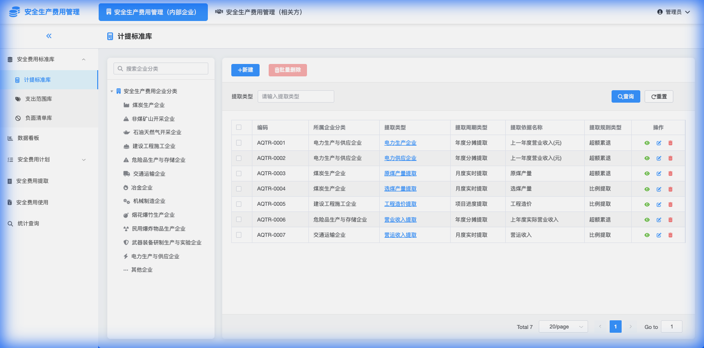

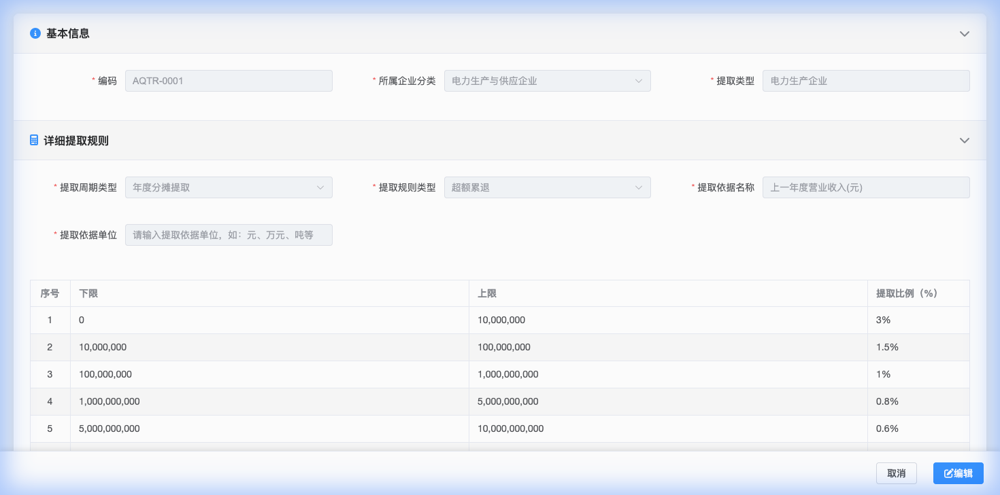

### 10.2 支出范围库

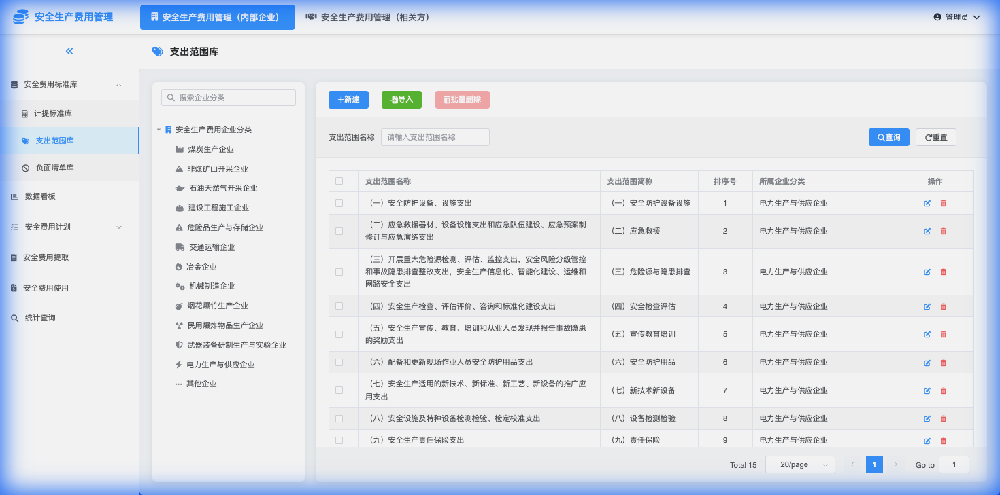

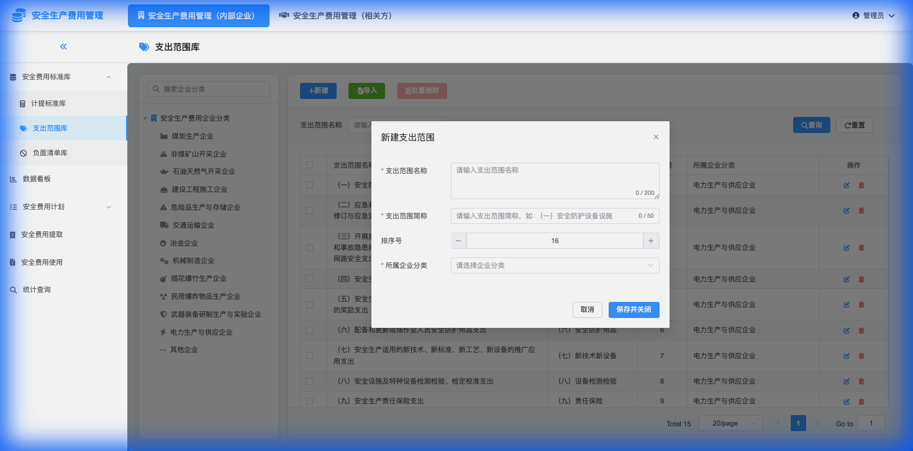

### 10.3 负面清单库

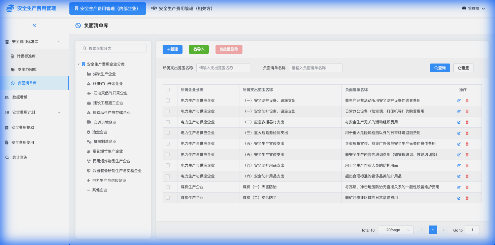

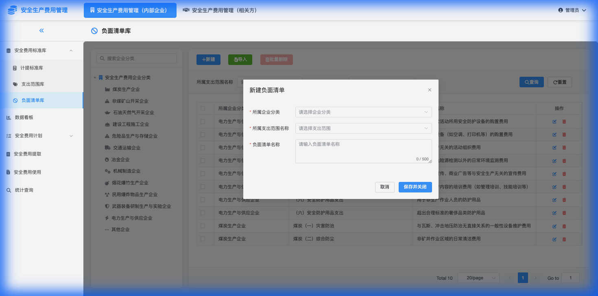

### 10.4 预审计划

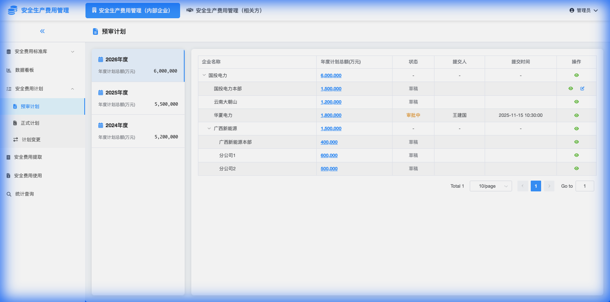

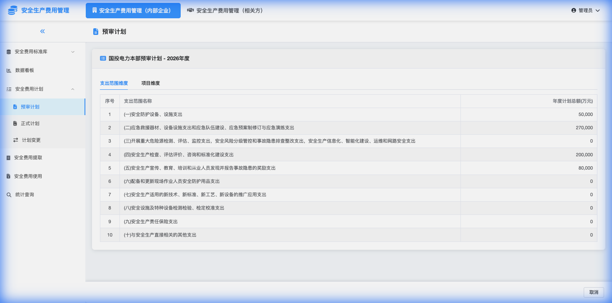

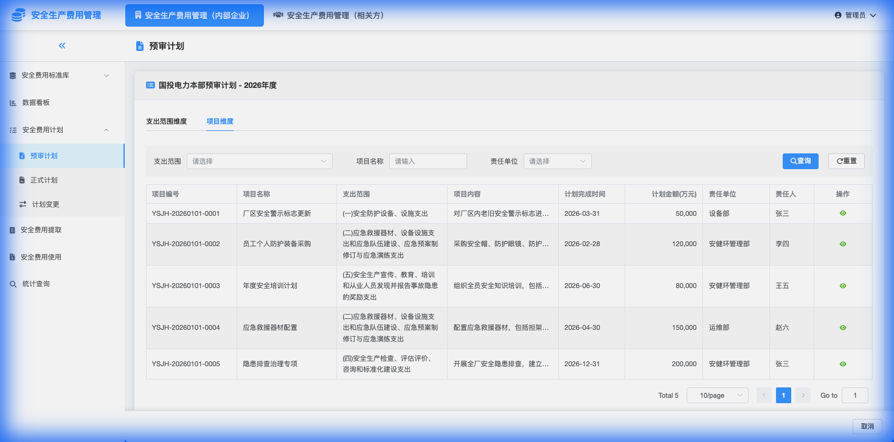

### 10.5 正式计划

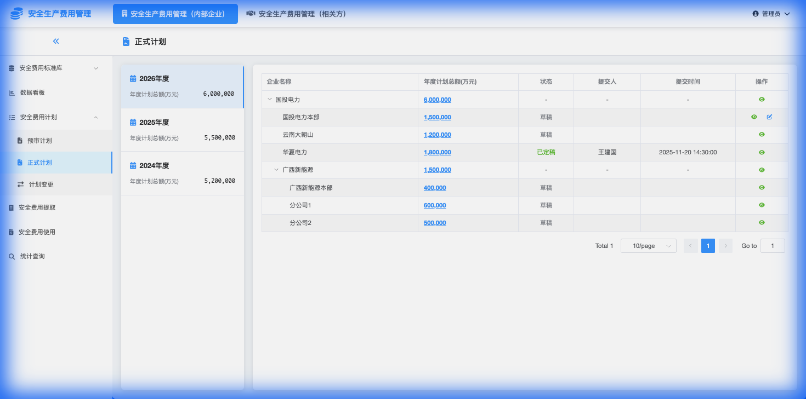

### 10.6 计划变更

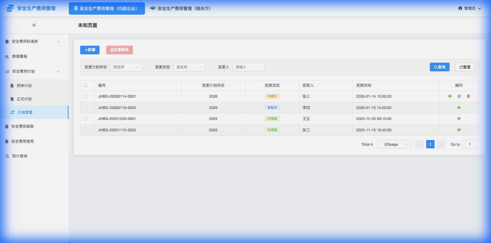

### 10.7 安全费用提取

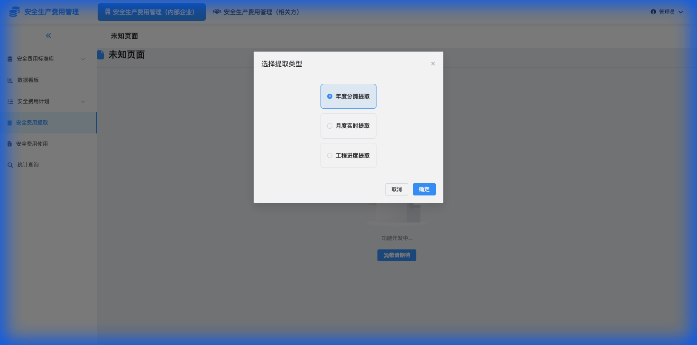

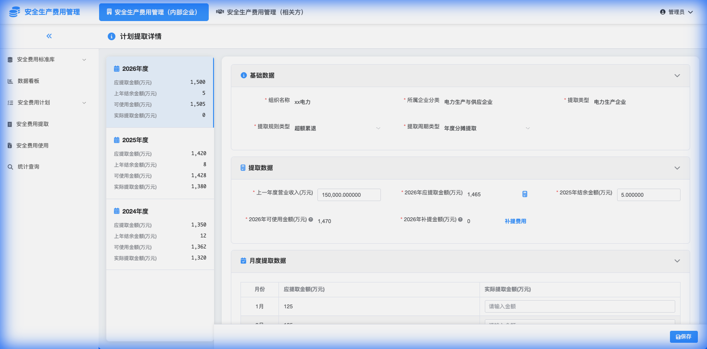

### 10.8 安全费用使用

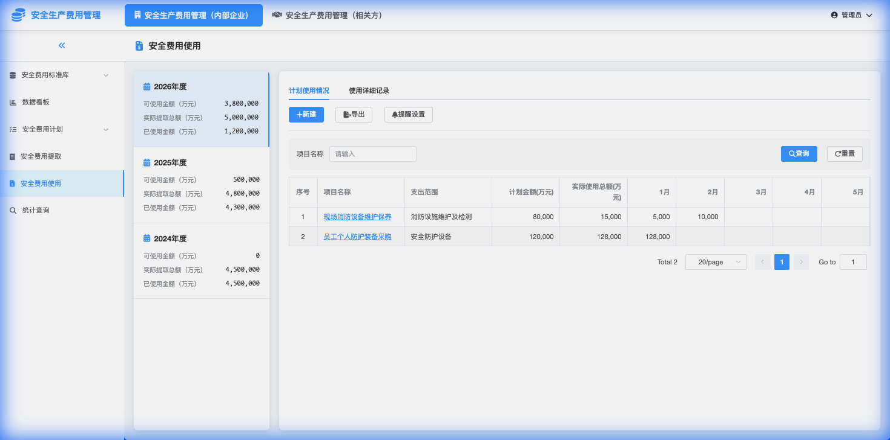

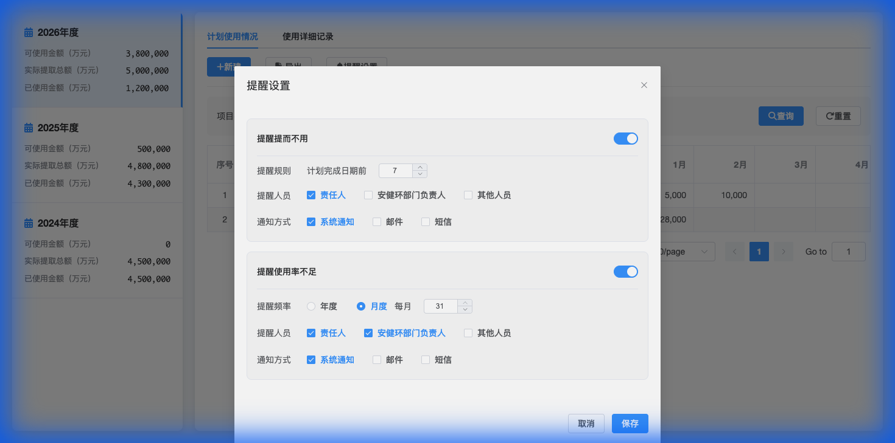

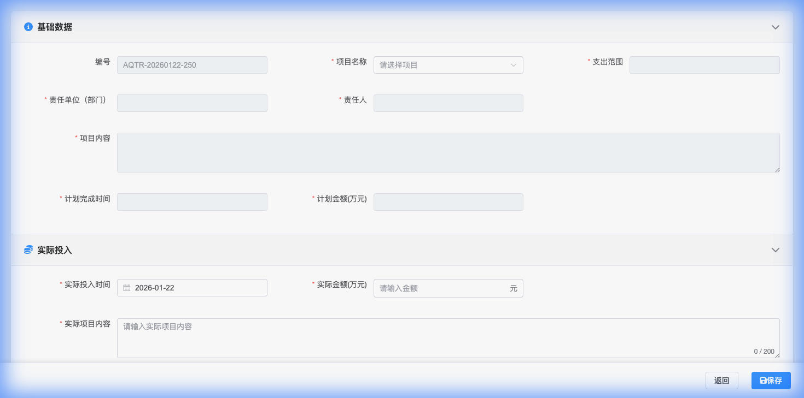
